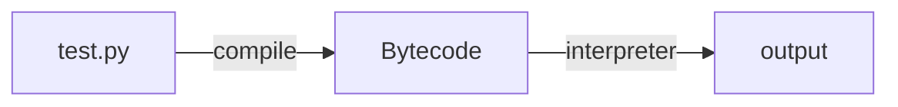

### How to Extending Pytyhon With C

Step 1:  Write Your own c file

```c
// "Python.h" defines a set of functions, macros and variables that provide access to most aspects of the Python run-time system

#include <Python.h>
static PyObject *
spam_system(PyObject *self, PyObject *args)
{
    const char *command;
    int sts;

    if (!PyArg_ParseTuple(args, "s", &command))
        return NULL;
    sts = system(command);
    return Py_BuildValue("i", sts);
}

// The Module's Method Table and Intialization Function
// the method in SpamMethods can be access in python 
// METH_O/METH_VARARGS/METH_NOARGS
// struct PyMethodDef{char *ml_name; PyCFunction ml_meth; int ml_flags; char *ml_doc;}
// 其中ml_name暴露给python程序的函数名， ml_meth函数指针, ml_flags传参方式, ml_doc文档
static PyMethodDef SpamMethods[] = {
    ...
    {"system",  spam_system, METH_VARARGS,
     "Execute a shell command."},
    ...
    {NULL, NULL, 0, NULL}        /* Sentinel */
};

// When the Python Program imports module spam for the first time, initspam() is called.
// and module 'spam' will inserted in sys.modules
PyMODINIT_FUNC
initspam(void)
{
    (void) Py_InitModule("spam", SpamMethods);
}

```

Step 2: compile c file to so file

```
gcc -I/usr/include/python2.7 -lpython2.7 -g fPIC -c spam.c -o spam.o \
&& gcc -shared spam.o -o spam.so
```


**Py_BulidValue**: 将C变量构建为Python的PyObject* **PyArg_ParseTuple**反之


CPython

```python
# opcode.h
# create code object
c = compile('test.py', 'test.py', 'exec')
```


**import任何模块都会加入到`sys.modules` dict中**

globals() 和 locals()返回全局和局部命名空间里的名字(函数内部使用，这返回函数内的相关名字)，return type是dict.

python内部reload机制只会更新或添加符号，不会删除符号


#### Python字节码



STORE_FAST/LOAD_FAST: 存储/读取PyFrameObject的f_localsplus

STORE_NAME/LOAD_NAME: 存储/读取(以此搜索local，global，builtin)local命名空间

模块的栈帧对象中的`f_locals` 和`f_globals` 值一样，都是`sys.modules['__main__'].__dict__` , 因此python

中函数定义顺序无关，函数声明和实现其实是分离的，声明的字节码指令在模块的PyCodeObject中执行，而实现的字节码指令则是在函数自己的PyCodeObject中

