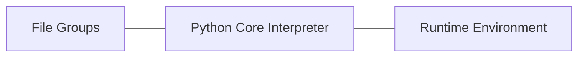

#### Python总体架构



- File Groups(Core Modules, Library, User-defined Modules)：提供大量模块、库以及用户自定义模块

- Python Core(Interpreter): Scanner, Parser, Compiler, Code Evaluator

  ```mermaid
  graph TD
  A[Scanner]--词法分析,生成token-->B[Parser]
  B--语法分析,生成AST语法树-->C[Compiler]
  C--生成ByteCode,由Code Evaluator执行-->D[Code Evaluator]
  
  ```

  

- Runtime Enviroment(Object/Type Structures, Memory Allocator, Current State of Python)：包括对象/类型系统，内存分配器，运行时状态信息，维护Interpreter在执行字节码时的不同状态(正常状态/异常)之间切换，可视为有穷状态机。

#### Python源码结构

- **Include**: 包含Python提供的所有头文件，用户编写定义模块扩展python，需要用到此目录下头文件
- **Lib**：包含Python自带的所有标准库，如os等，均用python编写，对速度要求不太严格
- **Modules**：包含所有用c语言编写的模块，如cStringIo等，此类模块对速度要求非常严格，
- **Parser**：包含Interpreter中Scanner和Parser部分，负责词法和语法分析。
- **Objects**：包含所有python的内建对象，如int、list、dict等，同时包含python在运行时需要的内部使用对象的实现
- **Python**：包含了python解释器中的Compiler和执行引擎部分，是python运行的核心所在
- **PCBuild**：包含vs工程，用于编译python

