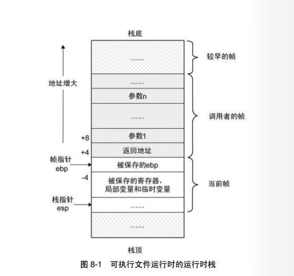
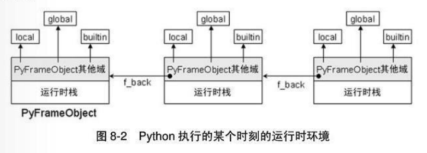
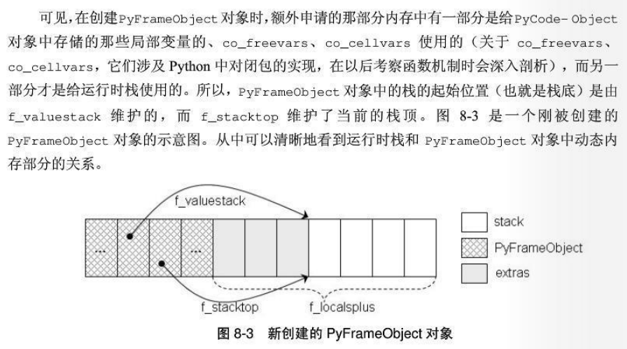
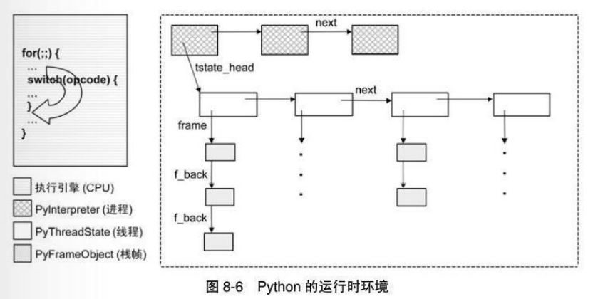
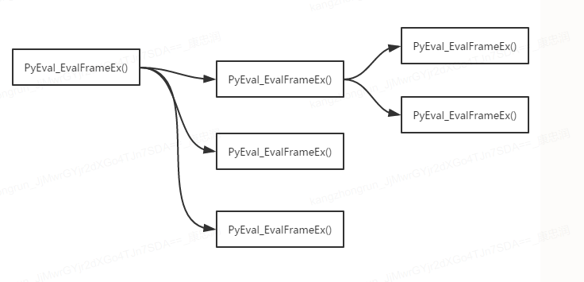

1. 编译产生Python的byte code  (program.pyc, 包含字符串、常量值、PyCodeObject等在源代码中出现的一切可用静态信息)
2. byte code 传给Python的Virtual Machine, 由VM安顺序一条条执行字节码

> 编译结果存于内存的PyCodeObject对象中，而Python结束运行后，编译结果又被保存到了pyc文件中，当下一次运行相同的程序时，Python会根据pyc文件中记录的编译结果直接建立内存中的PyCodeObject对象，无需再对源文件进行编译

### PyCodeObject

```c
[code.h]
typedef struct{
	PyObject_HEAD
	int co_argcount; // arguments(位置参数), except *args,
	int co_nlocals;  // local variables
	int co_stacksize;  // entries needed for evaluation stack
	int co_flags;  // 
	PyObject *co_code; //instruction opcodes
	PyObject *co_consts; // list (constants used)
	PyObject *co_names;  // list of strings(names used)
	PyObject *co_varnames;  //tuple of strings(local variable names)
	PyObject *co_freevars; //tuple of strings(free variable names), 实现闭包需要用到
	PyObject *co_cellvars;  //tuple of strings(cell variable names)内嵌函数所引用局部变量集合
	PyObject *co_filename; 
	PyObject *co_name;
	PyObject *co_inotab;  //string encoding addr <-> lineno mapping
}
```

每当进入一个新的名字空间/作用域，就会创建一个新的Code Block. 如下存在三个Code block.

```python
# demo.py
# Code Block <-->  NameSpace
class A(object):
	pass

def fun():
	pass
a = A()
fun()
```

import 机制会触发pyc文件的生成

**pyc文件包含三个部分：**

- python的magic number ，不同版本对应不同的magic number，import机制会比对magic number，版本不同则不会导入

- 写入时间，如果pyc记录时间与py早于最有一次修改时间，则重新编译py生成新的pyc

- PyCodeObject对象

`w_object` 对应不同的对象(string, int, list, dict)，执行不同的操作，比如向pyc文件写入一个list对象，其实只是将标识与list的内容写入，当python加载pyc文件时，会重新构建list


### Python虚拟机


**运行时栈与栈帧**



```c
void f(int a, int b)
{
	printf("a=%d, b=%d\n", a, b);
}
void g()
{
	f(1, 2);
}
int main()
{
	g();
}
```

当程序流程进入函数f，函数f的栈帧为当前帧，函数b为调用者的栈帧，函数对局部变量的操作都是在自己的栈帧中完成，而函数之间的调用是通过创建新的栈帧来完成。运行时栈帧从低地址向高地址延申，当g调用f，会在g的栈帧后面创建f的栈帧，会保留调用帧的栈帧指针。

**PyFrameObject** 对象

```c
// frameobject.h
typedef struct_frame{
	PyObject_VAR_HEAD
	struct _frame *f_back; //执行环境链上的前一个frame
	PyCodeObject *f_code;  //PyCodeObject对象
	PyObject *f_builtins;  //builtin名字空间
	PyObject *f_globals; // gobal 名字空间
	PyObject *f_locals;  // local名字空间
	PyObject **f_valuestack; //运行时栈的栈底位置
	PyObject **f_stacktop;  //运行时栈的栈顶位置
	...
	int f_lasti;  //上一条字节码指令在f_code中的偏移位置
	int f_lineno;  //当前字节码对应的源代码行
	...
	PyObject *f_localspuls[1];
}PyFrameObject	
```



**PyFrameObject** 创建

```c
// frameobject.c
PyFrameObject *
PyFrame_New(PyThreadState *tstate, PyCodeObject *code, PyObject *globals, PyObject *locals)
{
	PyFramObject *f;
	Py_ssize_t extras, ncells, nfrees, i;
	ncelss = PyTuple_GET_SIZE(code->co_cellvars);
	nfrees = PyTuple_GET_SIZE(code->co_freevars);
	// 四部分构成了PyFrameObject维护的动态内存区， 其大小由extras确定
	extras = code->co_stacksize + code->co_nlocals + ncells + nfrees;
	f = PyObject_GC_NewVar(PyFrameObject, &PyFrame_Type, extras);
	// 计算初始化时运行时栈的栈顶
	extras = code->co_nlocals + ncells + nfrees;
	// f_valuestack维护运行时栈的栈底，f_stacktop维护运行时栈的栈顶
	f->f_valuestack = f->f_localsplus + extras;
	f->f_stacktop = f->f_valuestack;
	return f;
}
```




**PyFrameObject** 访问

**sys module中的_getframe方法**

```python
# sys module
import sys
sys._getframe()

# frame_getter.py
import sys
def get_current_frame():
	try:
		1/0
	except Exception, e:
		type, value, traceback = sys.exc_info()
		return traceback.tb_frame.f_back
```

 **Python Modules**

Module加载的两种方法：1. import 2.python *,py, module加载的过程就是执行其中所有表达式的过程。

**Python LEGB**

```python
a = 1
def g():
	print a

def f():
	print a  # 此处会报错，reerenced before assignment
    # 因为f中对a进行了赋值，表明了变量a在此命名空间是存在的，即由于赋值语句引入的名字可以在此空间中找到。而此时a并没有赋值
	a = 2

g()
f()
```

其实python在编译时就已经知道名字究竟藏身何处了，即python采用的是静态作用域规则，仅仅根据程序正文就可确定名字引用策略。

将上述内容进行编译成字节码

```python
def g():
	#0 LOAD_GLOBAL    0 (a)   表明在global名字空间查找
	#3 PRINT_ITEM     
	#4 PRINT_NEWLINE

def f():
	#0 LOAD_FAST      0 (a)	  表明在local命名空间查找
	#3 PRINT_ITEM
	#4 PRINT_NEWLINE
```

如果我们想要使用外围作用域，可以使用global

```python
a = 1
def f():
	global a 
	print a
	a = 2
f()
print a #输出2
```

```python
# module1.py
import module2
owner = 'module'
module2.show_owner()  # print module2

# module2.py
owner = 'module2'
def show_owner():
	print owner # 名字引用不能访问自身module之外的命名空间
```

**Python虚拟机运行框架**

`PyEval_EvalFrameEx in ceval.c`

Python虚拟机从头到尾遍历co_code来执行字节码指令序列。依托三个变量完成: `first_instr` `next_instr` `f_lasti`, 其框架是一个for循环加上一个巨大的switch/case结构

```c
[ceval.c]
PyObject* PyEval_EvalFrameEx(PyFrameObject *f, int thowflag)
{
    ...
    // 获取当前活动线程对应的线程状态对象
    PyThreadState *tstate = PyThreadState_GET();
    ...
    // 设置线程状态对象中的frame
    tstate->frame = f;
    co = f->f_code;
    names = co->co_names;
    consts = co->co_consts;
    why = WHY_NOT;
    ...
    for(;;){
    ...
    fast_next_opcode:
        f->f_lasti = INSTR_OFFSET();
        // 获取字节码
        opcode = NEXTOP();
        oparg = 0;
        // 如果指令需要参数，获得指令参数
        if (HAS_ARG(op_code))
            oparg = NEXTARG();
dispatch_opcode:
	switch (opcode){
	case:
    ...
	}
}
}
```

**Python虚拟机运行时环境**

**Python中通过一个全局解释器GIL(Global Interpreter Lock)来是实现线程同步的，PyInterpreterObject对象表示进程概念，PyThreadState对象表示线程概念** 

Python虚拟机开始执行时，会将当前线程状态对象中的frame设置为当前的执行环境(frame);



**PyCodeObject存储静态信息，PyFrameObject存储运行时动态信息，而PyFunctionObject为函数定义后运行前的一个暂存对象，保存静态信息和运行时上下文环境，因此PyFunctionObject可作为PyCodeObject和PyFrameObject的桥梁**



最外层PyEval_EvalFrameEx，是`__main__`模块对应的PyCodeObject`__name__ == '__main__'` ，因此python虚拟机开始执行时，会去寻找`__main__` 模块，取其PyCodeObject，并调用PyEval_EvalFrameEx去执行，进而触发整个虚拟机的运转，因此`__main__` 模块即python应用程序的入口函数。