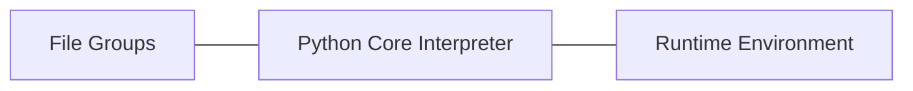

#### Python总体架构



- File Groups(Core Modules, Library, User-defined Modules)：提供大量模块、库以及用户自定义模块

- Python Core(Interpreter): Scanner, Parser, Compiler, Code Evaluator（Python核心or虚拟机）

  ```mermaid
  graph TD
  A[Scanner]--词法分析,生成token-->B[Parser]
  B--语法分析,生成AST语法树-->C[Compiler]
  C--生成ByteCode,由Code Evaluator执行-->D[Code Evaluator]
  
  ```

  - **Scanner(词法分析)**：将Python源代码或命令行输入的一行行Python代码切分为token

  - **Parser(语法分析)**：在Scanner分析结果上进行语法分析，建立抽象语法树(AST)

  - **Compiler(编译)**：根据建立的AST语法树生成指令集合---Python字节码(byte code)

  - **Code Evaluator(虚拟机)**：执行Python字节码（运行时）

    

- Runtime Enviroment(Object/Type Structures, Memory Allocator, Current State of Python)：

  包括对象/类型系统，内存分配器，运行时状态信息，维护Interpreter在执行字节码时的不同状态(正常状态/异常)之间切换，可视为有穷状态机。

  - **运行时状态**：维护解释器在执行字节码时不同的状态(比如正常状态和异常状态)之间的切换动作，可将其视为一个巨大复杂的有穷状态机

  - **内存分配器**：全权负责python中创建对象时，对内存的申请工作，实际它就是python运行时与C中malloc的一层接口

  - **对象/类型系统**：包含python中存在的各种内建对象，比如int，list，以及各种用户自定义的类型和对象

    

#### Python源码结构

- **Include**: 包含Python提供的所有头文件，用户编写定义模块扩展python，需要用到此目录下头文件

- **Lib**：包含Python自带的所有标准库，如os等，均用python编写，对速度要求不太严格

- **Modules**：包含所有用c语言编写的模块，如cStringIo等，此类模块对速度要求非常严格，

- **Parser**：包含Interpreter中**Scanner和Parser**部分，负责词法和语法分析。

- **Objects**：包含所有python的内建对象，如int、list、dict等，同时包含python在运行时需要的内部使用对象的实现

- **Python**：包含了python解释器中的**Compiler和执行引擎部分，是python运行的核心所在**

- **PCBuild**：包含vs工程，用于编译python

  

**Q： Python是如何进行内存管理的（内存管理机制）？**

1. ##### 引用计数

   引用计数为0则被删除  （无法解决循环引用

2. ##### 垃圾回收

   可以解决循环应用问题  （如果对象定义了`__del__`方法，gc也无能为力

   能够引用其它对象的对象被称为容器(Container), 只有容器之间才能形成循环引用

##### 调优：

1. 手动垃圾回收
2. 调高垃圾回收阈值(threshold)
3. 避免循环引用
4. 手动解循环引用
5. 使用弱引用 （弱引用：指引用一个对象时，不增加该对象引用计数