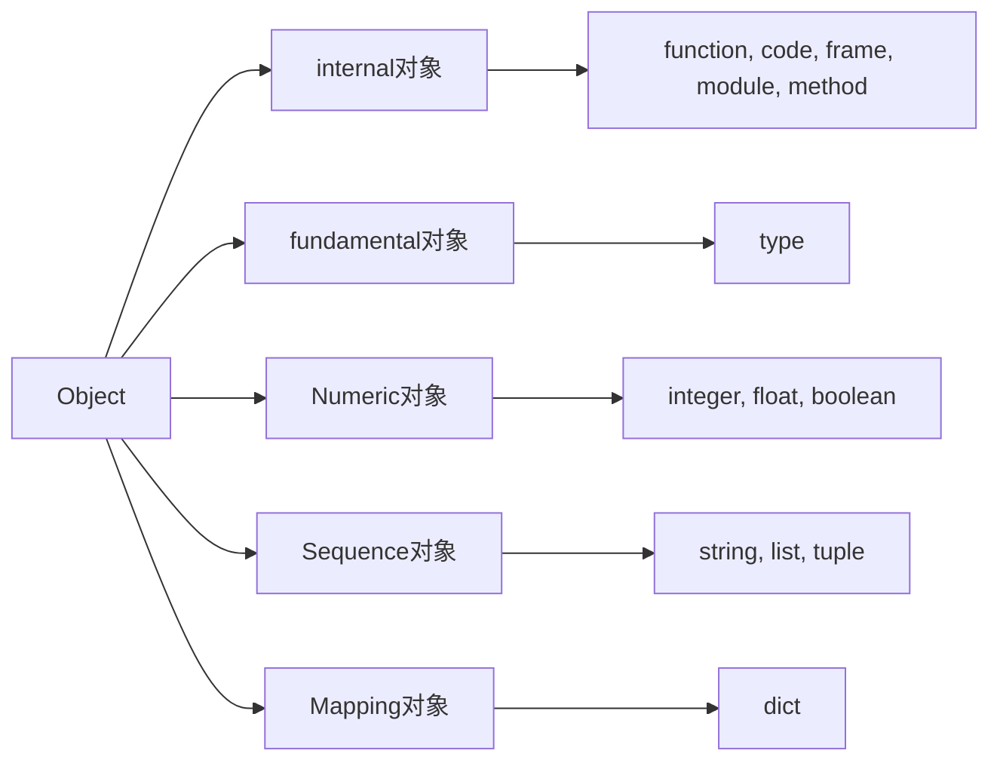

**一切皆对象**，对象再C层面，是什么样？以及类型对象再C层面是如何实现，类型对象与实例对象之间的关系？


### 1.1 `PyObject`

#### 1.1.1 对象机制的基石

对人来说对象是一个比较形象的概念，对计算机来说，一切皆字节，对象不过是一片被分配的内存空间，可能连续可能离散，不重要，重要的是再更高层次上其可以作为一个整体。

对象就是为C中的结构体再**堆上**申请的一块内存，一般来说，对象不能被**静态初始化**，并且也不能再**栈空间**上生存。唯一例外的是类型对象，Python所有的内建类型对象(int, string,等)都是被静态初始化的。

Python中一旦对象被创建，**其内存大小将不可变**，因此容纳可变长度数据的对象只能在对象内维护一个指向一块可变大小的内存区域的指针。**这么设定可使通过指针维护对象的工作变得非常简单**。  (比如对象A后跟着B，A大小增大，需要将A移动到内存中其它位置，否则就会覆盖B的数据)

Everything is Object

```c
[object.h]
//python 对象机制的核心基石
typedef struct _object{
	PyObject_HEAD
}PyObject;

#define PyObject_HEAD  \
	int ob_refcnt;  \
    struct _typeobject *ob_type;  

ob_refcnt   // 与python内存管理机制有关，实现了基于引用计数的垃圾收集机制
ob_type  // 指定一个对象类型的类型信息
```

#### 1.1.2 定长对象和变长对象

Python中对象可分为定长对象和变长对象，其中变长对象用`PyVarObject` ，定义了**ob_size**指明元素个数，`PyVarObject`实际是对`PyObject`的一个扩展，因此，在python中，所有对象都拥有相同的对象头部，使得Python对对象的引用变得非常统一，**只需要用一个`PyObject*`指针即可引用任意的一个对象**。

```c
#define PyObject_VAR_HEAD   \
	PyObject_HEAD			\
	int ob_size;  /*number of items in variable part*/

typdef struct {
	PyObject_VAR_HEAD
}PyVarObject;
```


#### 1.2 类型对象

如何确定对象所需内存空间的大小？

**`_typeobject`**中定义了很多信息，主要分为4类：

- 类型名，`tp_name`, 主要是Python内存以及调试的时候使用
- 创建改类型对象时分配内存空间大小的信息，即`tp_basicsize`和`tp_itemsize`;
- 与该类型对象相关联的操作信息（诸如`tp_print`这样的许多的函数指针）
- 描述的类型的类型信息


##### 1.2.1 对象的创建

以整型为例，Python一般提供了两种创建对象方法

	1.  Python C API: 用户可再C环境中与python交互。范型API(AOL)，可用于任何python对象
	PyObject* intObj = PyObject_New(PyObject, &PyInt_Type)
 	2.  通过类型对象`PyInt_Type`，与类型相关的API（COL），只能作用再某种类型的对象上。

`PyInt_Type` 创建流程 `tp_new-->tp_init`, 其中`tp_new`相当于C++中的new操作符，`tp_init`相当于构造函数


##### 1.2.2 对象的行为

`PyTypeObject`中定义了大量的函数指针，指向对应的函数或者NULL，这些函数指针可视为类型对象所定义的操作，决定一个对象运行时表现得行为。

比如`tp_hash`: 生成hash值，`tp_new`：创建对象，`tp_init`: 构造对象。

**`PyTypeObject`允许一种类型同时指定三种不同对象的行为特性**，比如通过重写class int的`__getitem__`方法可指定其具有`tp_as_mapping.mp_subscript`操作。


##### 1.2.3 类型的类型

`PyType_Type`, 为所有class的class，被称为`metaclass`.

比如，`PyInt_Type-ob_type` -----> `PytType_Type`


#### 1.3 Python对象的多态性

*Python是如何实现多态？*

**通过对象的ob_type域动态决定其类型，进而实现多态机制**。

`PyObject`和`PyTypeObject`, Python利用C语言完成了C++所提供的对象的多态特性。

例如：Python创建一个`PyIntObject`对象，分配内存，初始化，在Python内部会用一个`PyObject*` 变量（而不是`PyInObject*`）来保护和维护此对象。

也就是Python内部个函数之间传递的都是一种范型指针`PyObject*`, 根据指针所指对象的ob_type判断这个对象的类型。

```c
void Print(PyObject* object){
	object->ob_type->tp_print(object);
}
```

#### 1.4 引用计数

现代开发语言中一般选择由语言本身负责内存的管理和维护，即采用**垃圾收集机制**，比如Java和C#.

优点：把开发人员从维护内存分配和清理的繁重工作中解放出来

缺点：剥夺了程序员与内存亲密接触的机会，并付出一定效率为代价。

**引用计数是Python垃圾收集机制的一部分**，通过对象的`ob_refcnt`变量维护该对象的引用计数，进而决定对象的创建和消亡。

`_Py_NewReference(OP)`--引用计数初始化为1， `Py_INCREF(op)`--增加对象引用计数，`Py_DECREF(op)`--减少对象引用计数，减少到0后，调用对象的析构函数`tp_dealloc`来释放对象所占用的内存和系统资源。

但，引用计数减到0时，与该对象对应的析构函数会被调用，但是并**不一定会调用free释放内存空间**，如果这样会频繁地申请、释放内存空间导致执行效率低下。

因此，Python中大量采用了**内存对象池**的计数，对象析构时，将**对象占用的空间归还给内存池**。

#### 1.5 Python对象的内类

- Fundamental对象：类型对象
- Numeric对象：数值对象
- Sequence对象：容纳其它对象的序列集合对象
- Mapping对象：类型C++中的map关联对象
- Internal对象：Python虚拟机在运行时内部使用的对象




### `PyStringObject`


**经典效率问题：**使用"+"进行字符串连接效率及其低下，其根源在于Python中的PyStringObject对象是一个不可变对象，意味着一次"+"就要创建一个新的PyStringObject. 如果连接N个PyStringObject对象，就必须进行N-1次的内存申请以及内存搬运的工作。

**官方推荐做法：** 利用join对存储在list or tuple中的一组PyStringObject对象进行连接，只需要分配一次内存，执行效率大大提高。

### PyListObject

### PyDictObject

```c
typedef struct{
    Py_ssize_t me_hash;
    PyObject *m_key;
    PyObject *me_value;
}PyDictEntry;
```


**entry的三种状态**

**Unused**: me_key==NULL;me_vale==NULL

**Active**:me_key!=NULL, dummy; me_value!=NULL

**Dummy**:me_key==dummy;me_value=NULL


**PyDictObject两种搜索策略:** 

- lookdict : 通用

- lookdict_string：针对key为string


type内置函数PyType_Type的实例化接口

type(name, bases, atrr_dict)->a new type

```python
MyStr = type('MyStr', (str,), {'__div__': lambda self, s: self.split(s)})


# ==

class MyStr(str):
    def __div__(self, s):
        return self.split(s)

```


每次通过dot访问method，就会调用创建一个新的method，

```python
classs A(object):
	def foo(self):
		pass
a = A()
f1 = a.foo
f2 = a.foo
f3 = a.foo
# f1,f2,f3其实是三个不同的function 因此如果需要频繁访问一个类的method方法，可以只创建一个实例，并用一个变量引用住，之后每次需要使用这个method，可以直接使用该变量，可以提高效率
```


```python
# 修改函数默认参数
def foo(a, b):
	print a, b
foo.func_defaults = (2,)  # 设置默认参数顺序从后往前
foo(1)  # 1, 2
```

