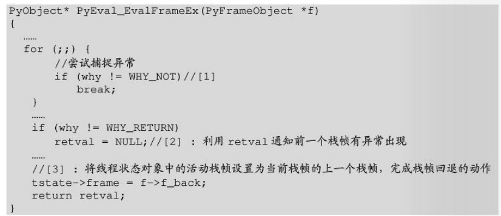
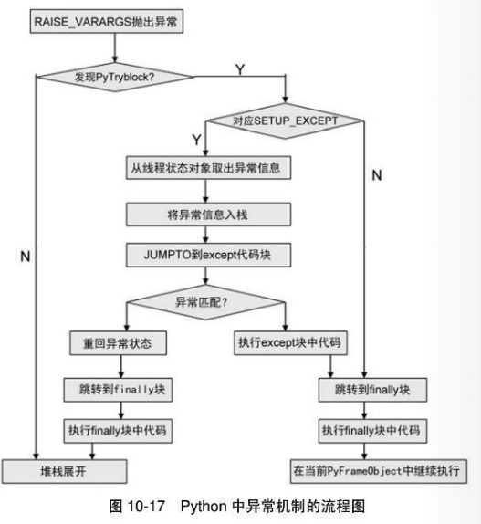

### Python虚拟机中的一般表达式

```c
// 一段修改python源代码用于debug的例子
if(strcmp(PyString_AsString(w), "PythoneVM") == 0){
	PyObject* target = PySys_GetObject("stdout");
	char temp[256] = {0};
	sprintf(temp, "[LOAD_NAME]: Search PyStringObject %s in local name space...%s\n", PyString_AsString(w), x==NULL?"False":"Success");
	PyFile_WriteString(temp, target);
}
```

### **Python控制流**

#### if控制流

#### for循环控制流

#### while循环控制流

#### 异常控制流

```python
# sys module提供访问python虚拟机存放在线程状态对象中的异常信息
try:
	1/0
except Exception:
	print sys.exc_onfo()

```

#### how to traceback

```c
[ceval.c]
PyObject* PyEval_EvalFrameEx(PyFrameObject *f){
	...
	for(;;){
		...
		if (why == WHY_EXCEPTION){
			// 处理异常，创建traceback对象
			PyTraceBack_Here(f);
			// c_tracefunc用户定义的追踪函数
			if (tstate->c_tracefunc != NULL)
				call_exc_trace(tstate->c_tracefunc, tstate->c_traceobj, f);
		}
		...
	}
}
```

```c
[traceback.c]
int PyTraceBack_Here(PyFrameObject *frame){
	// 获取线程状态对象
	PyThreadState *tstate = frame->f_tstate;
	// 保存线程状态对象中现在维护的traceback对象
	PyTracebackObject *oldtb = (PyTracebackObject *)tstate->curexc_traceback;
	// 创建新的traceback对象
	PyTracebackObject *tb = newtracebackobject(oldtb, frame);
	//将新的traceback对象交给线程状态对象
	tstate->curexc_traceback = (PyObject *)tb;
	Py_XDECREF(oldtb);
	return 0;
}


[traceback.h]
typedef struct _traceback{
	PyObject_HEAD
	struct _traceback *tb_next;
	struct _frame *tb_frame;
	int tb_lasti;
	int tb_lineno;
}PyTracebackObject;
```

当异常抛出时，python虚拟机会创建traceback对象，并在当前栈帧中寻找except语句，如果没有找到捕捉异常的动作，将退出当前活动栈帧，并沿着栈帧链表向上回退到一个栈帧。



当发生函数调用时，会创建新的PyFrameObject, 且python虚拟机会递归调用PyEval_EvalFrameEx.

#### exception_control.py

